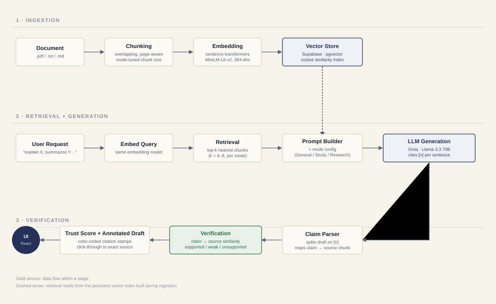
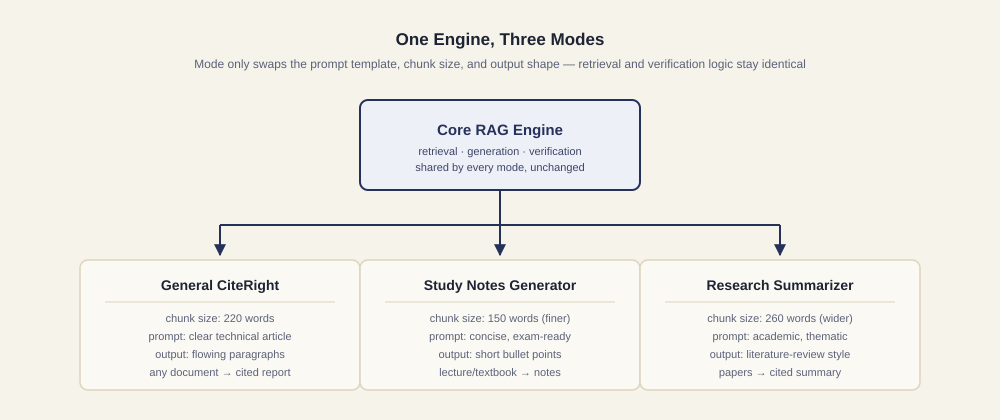

# CiteRight

**RAG-powered content generation with verifiable, per-claim citations.**

CiteRight doesn't just answer questions from your documents — it writes full drafts (articles, study notes, literature reviews) where every sentence is traced back to the exact source passage it came from, and then *independently checks* whether that citation actually holds up. It's a self-checking generator, not just a "chat with your PDF" tool.

> Built as a proof-of-concept for grounding LLM output in verifiable sources — the same core idea behind hallucination-mitigation systems, implemented end-to-end.

---

## Why this exists

Most RAG demos stop at retrieval-augmented *question answering*. CiteRight goes a step further in two ways:

1. **Generation, not just retrieval.** It produces long-form drafts, not single-turn answers.
2. **Verification, not blind trust.** After the LLM generates a citation, CiteRight re-checks — independently, using semantic similarity — whether the cited source actually supports the claim. If the model hallucinated or misread a source, that claim gets flagged red instead of silently passed through.

The output is a **trust score** (0–100%) and a color-coded, click-through draft: green stamps are verified, amber are weakly supported, red are unsupported.

---

## Architecture



**Pipeline, in order:**

| Stage | What happens |
|---|---|
| **1. Ingestion** | Uploaded document is parsed and split into overlapping, page-aware chunks. Chunk size is tuned per mode (finer for study notes, wider for research summaries). |
| **2. Embedding** | Each chunk is converted into a 384-dim vector via `sentence-transformers` (MiniLM-L6-v2), capturing meaning rather than exact wording. |
| **3. Retrieval** | The user's request is embedded the same way, and the top-k most semantically similar chunks are retrieved via cosine similarity. |
| **4. Generation** | Retrieved chunks + a mode-specific prompt are sent to Llama 3.3 70B (via Groq). The model is instructed to cite a source chunk `[n]` after every factual sentence. |
| **5. Verification** | Every generated claim is re-embedded and compared against the specific chunk it cited — checking whether the claim is *actually* supported, not just trusting the model's citation. |
| **6. Trust scoring** | Per-claim results (supported / weak / unsupported) roll up into a single trust score shown alongside the annotated draft. |

### One engine, three modes



Mode selection doesn't change the underlying engine — it only swaps the prompt template, chunk size, and output formatting. Retrieval and verification logic is identical across all three:

| Mode | Use case | Output style |
|---|---|---|
| **General CiteRight** | Any document → cited article/report | Flowing paragraphs |
| **Study Notes Generator** | Lecture/textbook → exam-ready notes | Short bullet points, finer page-level citations |
| **Research Summarizer** | Papers → cited literature review | Academic tone, thematically grouped |

---

## Key features

- 📄 **Multi-format ingestion** — PDF, TXT, Markdown
- 🎯 **Per-claim citation verification** — not just "did it cite something," but "does the citation actually hold up"
- 📊 **Trust score** — a single, explainable number for how grounded a draft is
- 🔍 **Click-through source drawer** — click any citation stamp to see the exact excerpt it's checked against
- 🖥️ **Live pipeline console** — watch retrieval → generation → verification happen step by step
- 🌓 **Dark mode**
- 🧩 **Mode-swappable engine** — same retrieval/verification core, different generation behavior

---

## Tech stack

| Layer | Technology | Why |
|---|---|---|
| Backend framework | **FastAPI** (Python) | Async, clean for ML serving, auto-generated OpenAPI docs |
| RAG core | **Built from scratch** — no LangChain | Demonstrates understanding of retrieval internals, not just library calls |
| Embeddings | **sentence-transformers** (`all-MiniLM-L6-v2`) | Free, fast on CPU, 384-dim, no external API dependency |
| Vector store | **Supabase (Postgres + pgvector)** | Free tier, production-grade vector search, real Postgres experience |
| LLM | **Groq API** (Llama 3.3 70B) | Free tier, very fast inference, OpenAI-compatible API |
| Frontend | **React 19 + Vite** | Fast dev/build, no unnecessary framework overhead |
| Styling | **Hand-written CSS**, custom design system | No component library — fully custom "editorial manuscript" visual identity |
| Fonts | **Fraunces, Inter, JetBrains Mono** (self-hosted via `@fontsource`) | No external font CDN requests |
| Backend hosting | **Render** | Free tier, simple FastAPI deployment |
| Frontend hosting | **Vercel** | Free tier, fast static hosting + CDN |

---

## Project structure

```
citeright/
├── app/
│   ├── core/
│   │   ├── chunking.py          # document parsing + overlapping chunking
│   │   ├── embeddings.py        # embedding backend (sentence-transformers + dev fallback)
│   │   ├── supabase_store.py    # persistent vector search (Supabase pgvector)
│   │   ├── generation.py        # LLM prompt building + citation-aware generation
│   │   ├── verification.py      # claim ↔ source semantic verification
│   │   └── document_manager.py  # per-document indexing lifecycle
│   ├── modes/
│   │   └── config.py            # the 3 mode configs (prompt, chunk size, top-k)
│   └── main.py                  # FastAPI app + endpoints
├── data/
│   └── sample_docs/             # test documents
├── docs/
│   ├── architecture.svg
│   └── modes-architecture.svg
├── frontend/
│   ├── src/
│   │   ├── components/
│   │   │   ├── UploadPanel.jsx
│   │   │   ├── ModeStamps.jsx
│   │   │   ├── Manuscript.jsx       # renders draft with citation stamps
│   │   │   ├── TrustLedger.jsx      # trust score + verification breakdown
│   │   │   ├── SourceDrawer.jsx     # click-through source excerpt panel
│   │   │   └── ProcessConsole.jsx   # live pipeline step console
│   │   ├── App.jsx
│   │   ├── api.js
│   │   └── index.css                # design tokens
│   └── package.json
├── tests/
├── requirements.txt
├── test_groq_local.py           # standalone Groq connectivity + quality test
└── README.md
```

---

## Running locally

### Backend

```bash
cd citeright
python3 -m venv venv
source venv/bin/activate        # Windows: venv\Scripts\activate
pip install -r requirements.txt
cp .env.example .env            # add your GROQ_API_KEY
uvicorn app.main:app --reload
```

Backend runs at `http://localhost:8000` (interactive API docs at `/docs`).

### Frontend

```bash
cd citeright/frontend
npm install
npm run dev
```

Frontend runs at `http://localhost:5173`.

### Environment variables

| Variable | Where | Required | Description |
|---|---|---|---|
| `GROQ_API_KEY` | backend `.env` | Yes | API key from [console.groq.com](https://console.groq.com) |
| `SUPABASE_DB_URL` | backend `.env` | Yes | Supabase connection string (transaction pooler) |
| `EMBEDDING_BACKEND` | backend `.env` | No | Force `sentence-transformers` or `tfidf`. Auto-detects if unset. |
| `VITE_API_BASE` | frontend `.env.local` | Yes | URL of the backend API (e.g. `http://localhost:8000` in dev) |

---

## API reference

| Endpoint | Method | Description |
|---|---|---|
| `/health` | GET | Health check |
| `/modes` | GET | List available generation modes |
| `/documents/upload` | POST | Upload + index a document (multipart form, `mode` query param) |
| `/generate` | POST | Generate a cited draft (`document_id`, `query`, `mode`) → draft + per-claim verification + trust score |

Full interactive schema available at `/docs` when the backend is running.

---

## Roadmap

- [x] Deploy to Render (backend) + Vercel (frontend)
- [x] Swap in-memory vector store for Supabase pgvector (persistence across restarts)
- [ ] Streamed pipeline progress (real-time, not simulated) via SSE
- [ ] Multi-document ingestion per session
- [ ] Configurable verification thresholds per mode

---

## Author

**Vadla Sadvik Kumar** — B.Tech CSE (AI/ML), Ellenki College of Engineering and Technology
GitHub: [@sadvik-asus](https://github.com/sadvik-asus)
